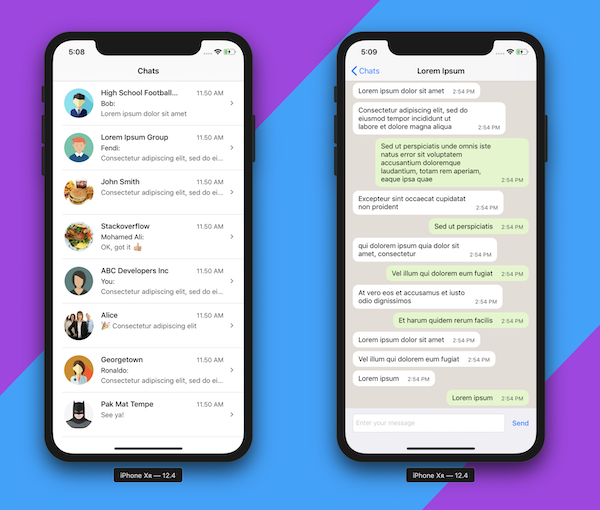

##  Simple Chat UI (30% like WhatsApp)
iOS Apps, for simple chatting or messaging view, developed with UIableView and custom UITableViewCells (no third party library or pods required)

### Development Environment
- Xcode 10
- Swift 5
- IPhone Simulator (not run or tested for iPad)

### Installation
No specific installation required, just hit the Run button.

### To be Added (Maybe)
- Image
- Sender name
- Message bubble tail

### License
Licensed under the [MIT license](http://opensource.org/licenses/MIT)
